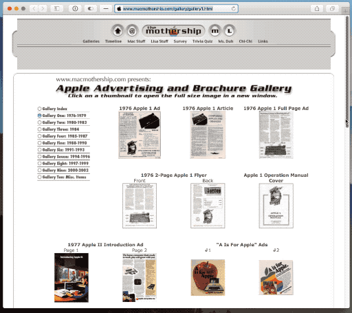

# my-first-safari-extension
Safari extension template/prototype for image extraction

## What is it?

This is an example of how to write the newer style of Safari extension where the extension is bundled into an app.  I wrote it mainly for my own education, but thought it might be useful for others, since the official documentation is a bit thin at times.  I was going to develop it with more image extraction features and release it as an app, but I figured it'd never make it through App Store review, so I just tinkered with it until it did what I personally wanted.

## What does it do?

When you click the toolbar button, it scans the page looking for <A> tags that have an HREF attribute that ends with .jpg, .gif, or .png.  In other words, it finds direct links to images on the current page.  It then rewrites the page as  tags referencing the full size image.

So, if you are on an image gallery page that has a bunch of thumbnails that direct link to images, this will pull out all the full size images into a single page.

It won't work if the thumbnails link to a secondary "image viewer" page (Pinterest, etc).  The links have to go directly to the images themselves.  But you could use this code as a jumping-off point for a more capable extension.

## Building and running

You'll want to change the Xcode project settings for code signing to use your own certificate, or to not sign.  To use an unsigned extension in Safari, you must check "Allow Unsigned Extensions" from Safari's "Develop" menu.  If you don't have the "Develop" menu, you can enable it in the Advanced tab of Safari's prefs.

Build and run the app at least once so Safari notices it.  The app does nothing except present a blank window.  If all is well, you should now see a new item called "The Actual Extension" in the Extensions tab of Safari's prefs.  That's our guy, enable him.  The button should get added to Safari's toolbar.

When you make changes to the extension, it may sometimes require some combination of relaunching Safari, toggling the extension off and on, or relaunching the container app to get Safari to notice the changes.

Good luck and have fun!

